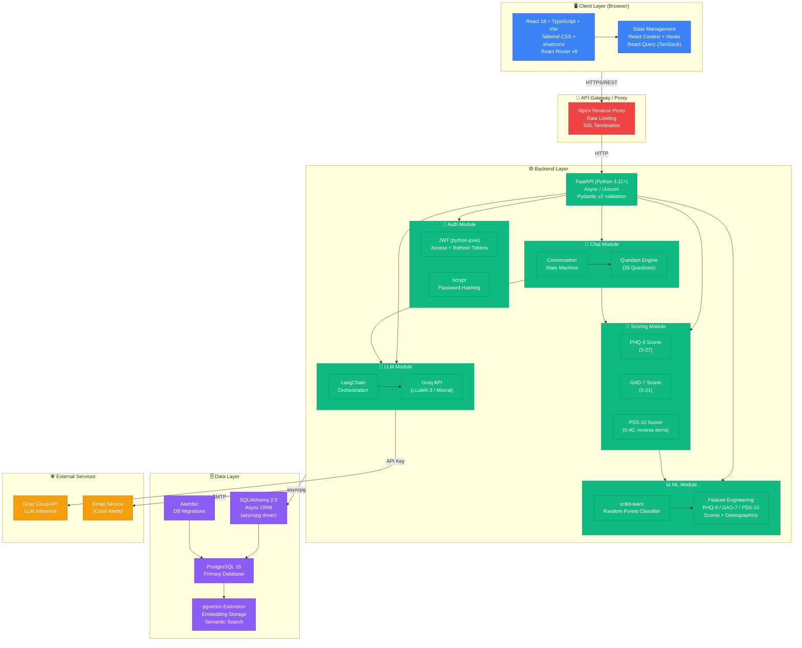
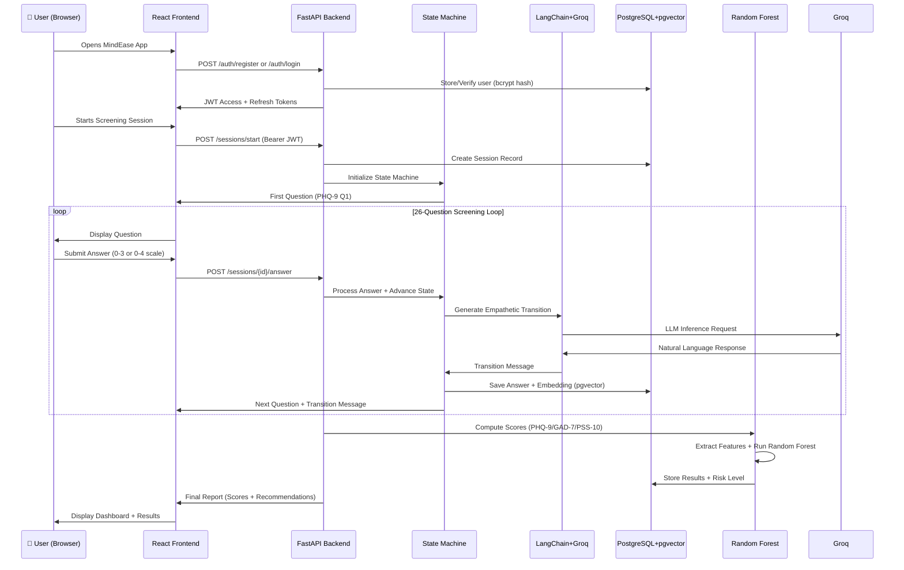
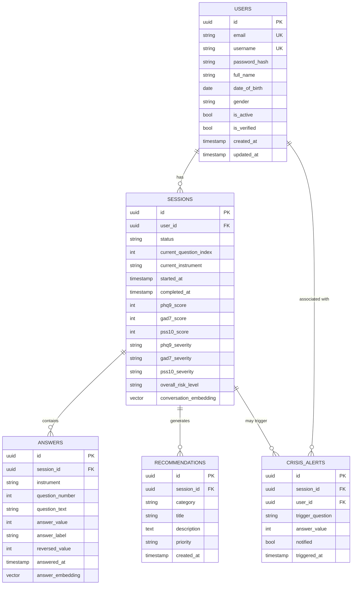
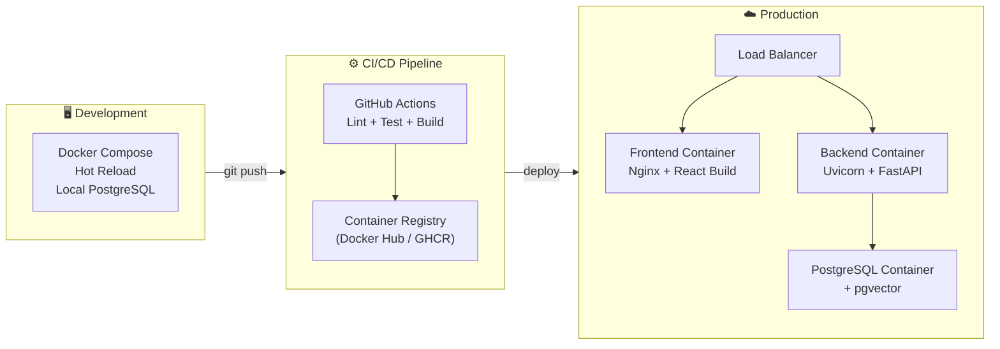

# MindEase System Architecture

## Full System Architecture Diagram

```mermaid
graph TB
    subgraph Client["🖥️ Client Layer (Browser)"]
        UI["React 18 + TypeScript + Vite
        Tailwind CSS + shadcn/ui
        React Router v6"]
        STATE["State Management
        React Context + Hooks
        React Query (TanStack)"]
        UI --> STATE
    end

    subgraph Gateway["🔀 API Gateway / Proxy"]
        NGINX["Nginx Reverse Proxy
        Rate Limiting
        SSL Termination"]
    end

    subgraph Backend["⚙️ Backend Layer"]
        API["FastAPI (Python 3.11+)
        Async / Uvicorn
        Pydantic v2 validation"]

        subgraph Auth["🔐 Auth Module"]
            JWT["JWT (python-jose)
            Access + Refresh Tokens"]
            BCRYPT["bcrypt
            Password Hashing"]
        end

        subgraph Chat["💬 Chat Module"]
            SM["Conversation
            State Machine"]
            QE["Question Engine
            (26 Questions)"]
            SM --> QE
        end

        subgraph LLM["🤖 LLM Module"]
            LC["LangChain
            Orchestration"]
            GROQ["Groq API
            (LLaMA 3 / Mixtral)"]
            LC --> GROQ
        end

        subgraph ML["📊 ML Module"]
            RF["scikit-learn
            Random Forest Classifier"]
            FE["Feature Engineering
            PHQ-9 / GAD-7 / PSS-10
            Scores + Demographics"]
            RF --> FE
        end

        subgraph Scoring["🧮 Scoring Module"]
            PHQ["PHQ-9 Scorer
            (0-27)"]
            GAD["GAD-7 Scorer
            (0-21)"]
            PSS["PSS-10 Scorer
            (0-40, reverse items)"]
        end

        API --> Auth
        API --> Chat
        API --> LLM
        API --> ML
        API --> Scoring
        Chat --> LLM
        Chat --> Scoring
        Scoring --> ML
    end

    subgraph Data["🗄️ Data Layer"]
        PG["PostgreSQL 15
        Primary Database"]
        PGV["pgvector Extension
        Embedding Storage
        Semantic Search"]
        ORM["SQLAlchemy 2.0
        Async ORM
        (asyncpg driver)"]
        ALEMBIC["Alembic
        DB Migrations"]
        PG --> PGV
        ORM --> PG
        ALEMBIC --> PG
    end

    subgraph External["🌐 External Services"]
        GROQ_API["Groq Cloud API
        LLM Inference"]
        EMAIL["Email Service
        (Crisis Alerts)"]
    end

    Client -->|"HTTPS/REST"| NGINX
    NGINX -->|"HTTP"| API
    Backend -->|"asyncpg"| ORM
    LLM -->|"API Key"| GROQ_API
    Backend -->|"SMTP"| EMAIL

    classDef clientStyle fill:#3B82F6,color:#fff,stroke:#1D4ED8
    classDef backendStyle fill:#10B981,color:#fff,stroke:#059669
    classDef dataStyle fill:#8B5CF6,color:#fff,stroke:#6D28D9
    classDef externalStyle fill:#F59E0B,color:#fff,stroke:#D97706
    classDef gatewayStyle fill:#EF4444,color:#fff,stroke:#DC2626

    class UI,STATE clientStyle
    class API,Auth,Chat,LLM,ML,Scoring,JWT,BCRYPT,SM,QE,LC,GROQ,RF,FE,PHQ,GAD,PSS backendStyle
    class PG,PGV,ORM,ALEMBIC dataStyle
    class GROQ_API,EMAIL externalStyle
    class NGINX gatewayStyle
```

## Component Interaction Flow

```mermaid
sequenceDiagram
    participant U as 👤 User (Browser)
    participant FE as React Frontend
    participant API as FastAPI Backend
    participant SM as State Machine
    participant LLM as LangChain+Groq
    participant DB as PostgreSQL+pgvector
    participant ML as Random Forest

    U->>FE: Opens MindEase App
    FE->>API: POST /auth/register or /auth/login
    API->>DB: Store/Verify user (bcrypt hash)
    API->>FE: JWT Access + Refresh Tokens

    U->>FE: Starts Screening Session
    FE->>API: POST /sessions/start (Bearer JWT)
    API->>DB: Create Session Record
    API->>SM: Initialize State Machine
    SM->>FE: First Question (PHQ-9 Q1)

    loop 26-Question Screening Loop
        FE->>U: Display Question
        U->>FE: Submit Answer (0-3 or 0-4 scale)
        FE->>API: POST /sessions/{id}/answer
        API->>SM: Process Answer + Advance State
        SM->>LLM: Generate Empathetic Transition
        LLM->>Groq: LLM Inference Request
        Groq->>LLM: Natural Language Response
        LLM->>SM: Transition Message
        SM->>DB: Save Answer + Embedding (pgvector)
        SM->>FE: Next Question + Transition Message
    end

    API->>ML: Compute Scores (PHQ-9/GAD-7/PSS-10)
    ML->>ML: Extract Features + Run Random Forest
    ML->>DB: Store Results + Risk Level
    API->>FE: Final Report (Scores + Recommendations)
    FE->>U: Display Dashboard + Results
```

## Database Entity Relationship Diagram

```mermaid
erDiagram
    USERS {
        uuid id PK
        string email UK
        string username UK
        string password_hash
        string full_name
        date date_of_birth
        string gender
        bool is_active
        bool is_verified
        timestamp created_at
        timestamp updated_at
    }

    SESSIONS {
        uuid id PK
        uuid user_id FK
        string status
        int current_question_index
        string current_instrument
        timestamp started_at
        timestamp completed_at
        int phq9_score
        int gad7_score
        int pss10_score
        string phq9_severity
        string gad7_severity
        string pss10_severity
        string overall_risk_level
        vector conversation_embedding
    }

    ANSWERS {
        uuid id PK
        uuid session_id FK
        string instrument
        int question_number
        string question_text
        int answer_value
        string answer_label
        int reversed_value
        timestamp answered_at
        vector answer_embedding
    }

    RECOMMENDATIONS {
        uuid id PK
        uuid session_id FK
        string category
        string title
        text description
        string priority
        timestamp created_at
    }

    CRISIS_ALERTS {
        uuid id PK
        uuid session_id FK
        uuid user_id FK
        string trigger_question
        int answer_value
        bool notified
        timestamp triggered_at
    }

    USERS ||--o{ SESSIONS : "has"
    SESSIONS ||--o{ ANSWERS : "contains"
    SESSIONS ||--o{ RECOMMENDATIONS : "generates"
    SESSIONS ||--o{ CRISIS_ALERTS : "may trigger"
    USERS ||--o{ CRISIS_ALERTS : "associated with"
```

## Deployment Architecture

```mermaid
graph LR
    subgraph Dev["🖥️ Development"]
        DV["Docker Compose
        Hot Reload
        Local PostgreSQL"]
    end

    subgraph CI["⚙️ CI/CD Pipeline"]
        GH["GitHub Actions
        Lint + Test + Build"]
        REG["Container Registry
        (Docker Hub / GHCR)"]
        GH --> REG
    end

    subgraph Prod["☁️ Production"]
        LB["Load Balancer"]
        FEC["Frontend Container
        Nginx + React Build"]
        BEC["Backend Container
        Uvicorn + FastAPI"]
        DBC["PostgreSQL Container
        + pgvector"]
        LB --> FEC
        LB --> BEC
        BEC --> DBC
    end

    Dev -->|"git push"| CI
    CI -->|"deploy"| Prod
```
